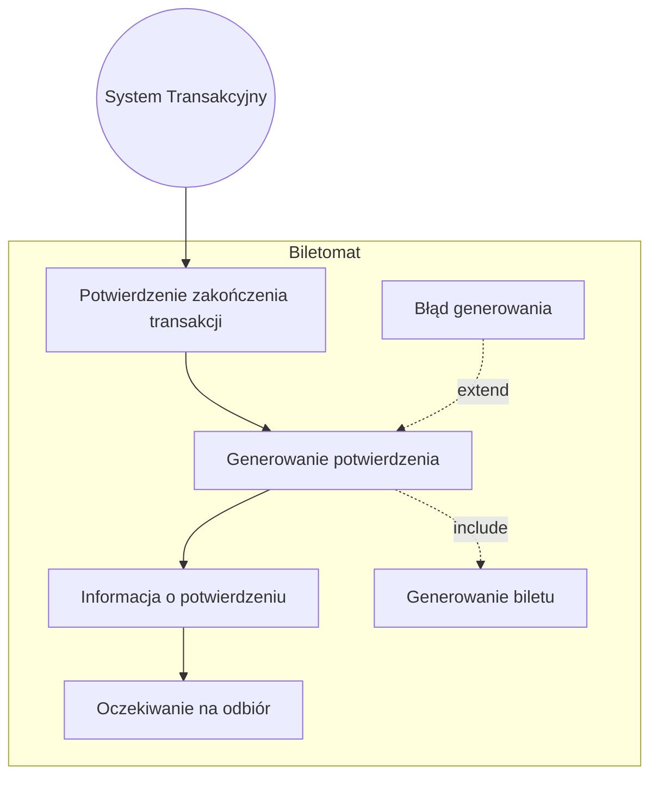
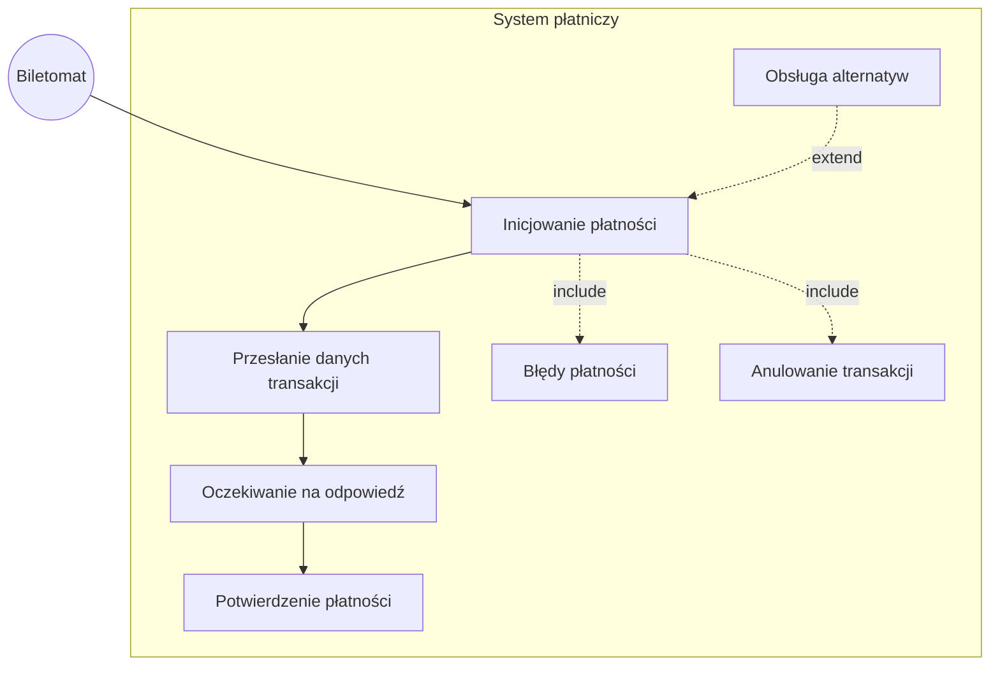
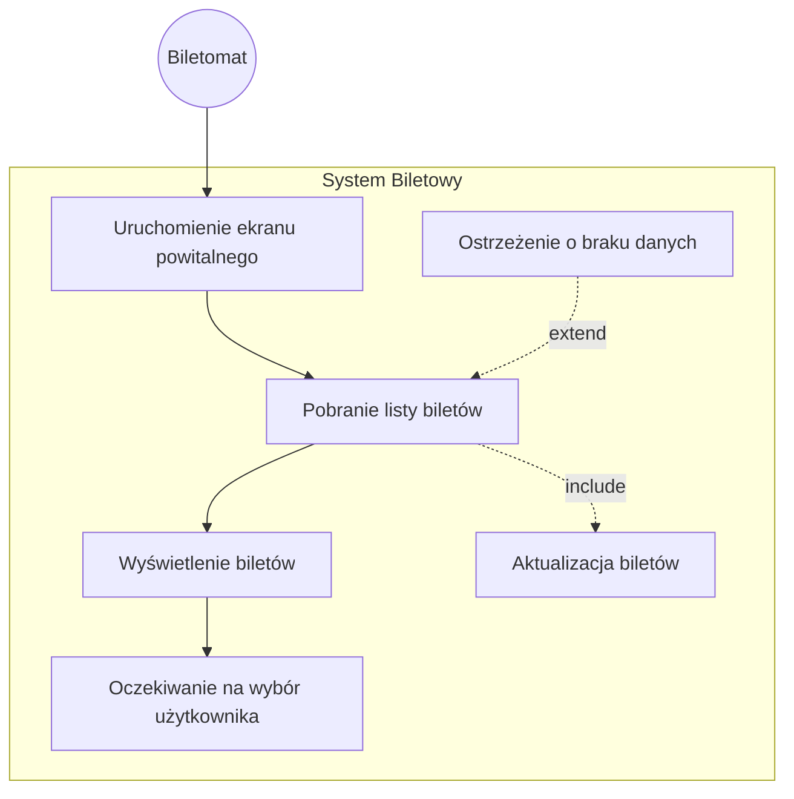
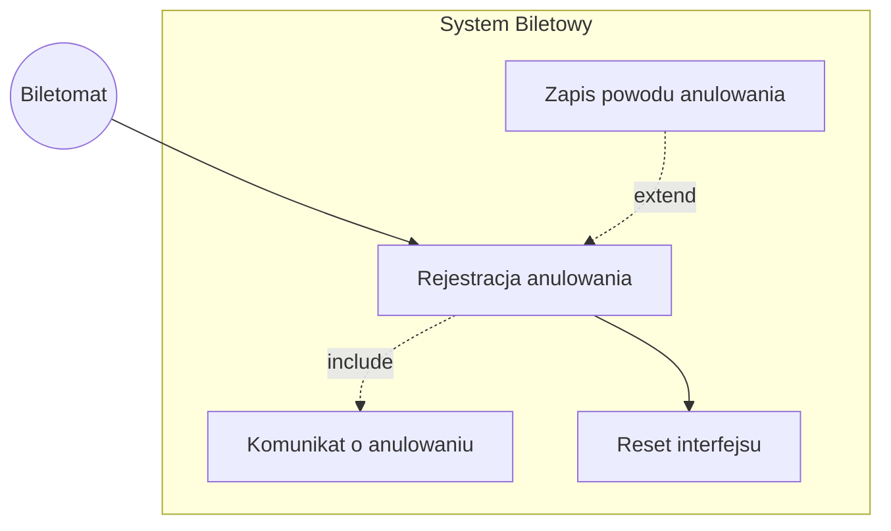
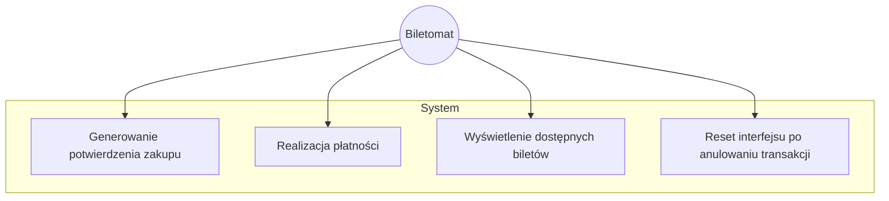
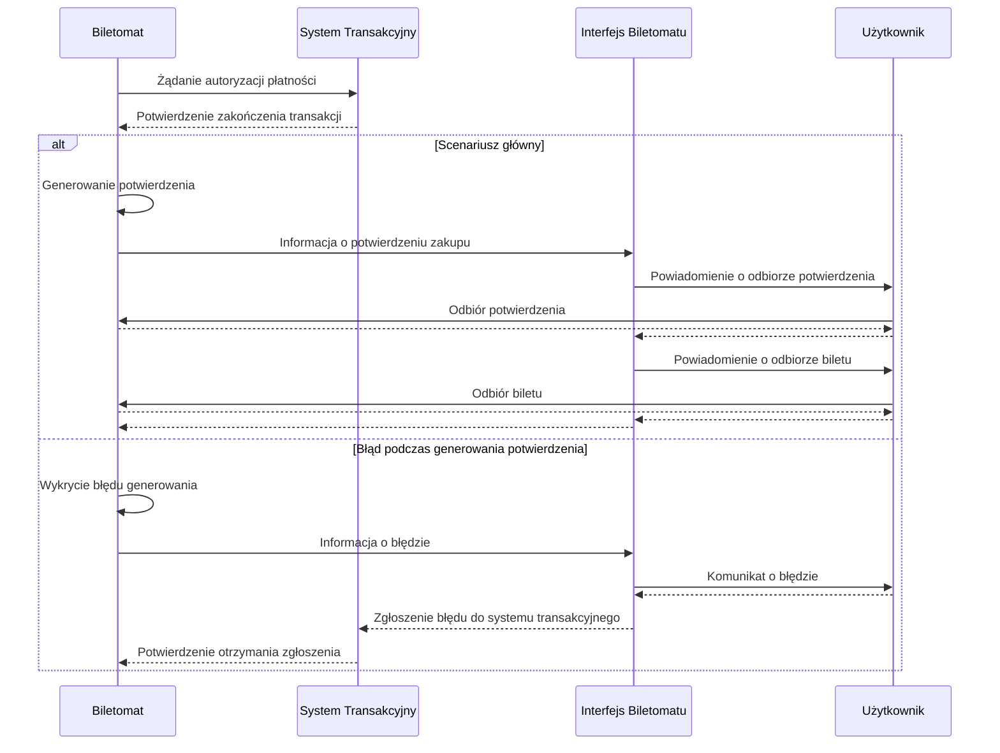
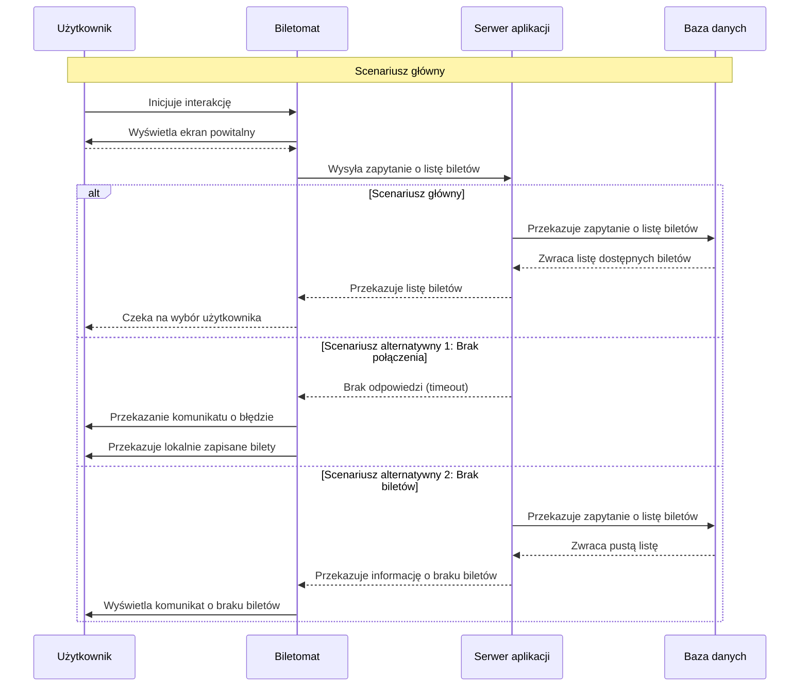
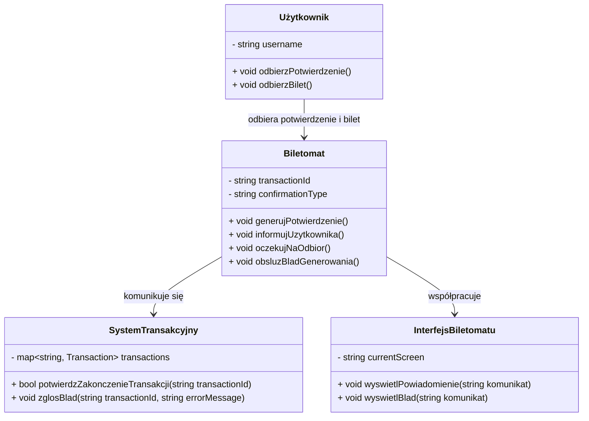
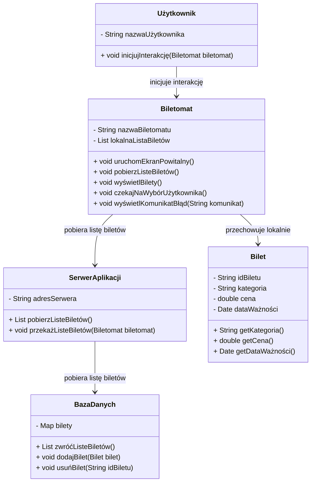

## 2. Historie dla biletomatu (urządzenia)
1. Jako biletomat, chcę posiadać czytelny ekran dotykowy, aby użytkownik mógł łatwo nawigować po interfejsie.
2. Jako biletomat, chcę być wyposażony w różne metody płatności (terminal kart, czytnik gotówki, NFC), aby obsługiwać różnorodne transakcje.
3. Jako biletomat, chcę wydawać resztę w gotówce, jeśli użytkownik zapłaci nadmiarowo, aby transakcja była zgodna z oczekiwaniami.
4. Jako biletomat, chcę automatycznie aktualizować listę dostępnych biletów i ich cen, aby zapewnić zgodność z polityką przewoźnika.
5. Jako biletomat, chcę rejestrować wszystkie transakcje i wysyłać raporty do systemu centralnego, aby umożliwić monitoring i kontrolę operacji.

## Diagram przypadków użycia dla biletomatu

### 1. Generowanie potwierdzenia zakupu

### 2. Realizacja płatności

### 3. Wyświetlenie dostępnych biletów

### 4. Reset interfejsu po anulowaniu transakcji

### 5. Wspólny diagram

## DIAGRAMY SEKWENCJI
### 1. DIAGRAM SEKWENCJI DLA PRZYPADKU UŻYCIA GENEROWANIA POTWIERDZENIA ZAKUPU
• **AKTOR:** BILETOMAT.  
• **OBIEKTY:** INTERFEJS BILETOMATU, UŻYTKOWNIK, SYSTEM TRANSAKCYJNY.  
• **KOLEJNOŚĆ KOMUNIKATÓW:**  
  1. **BILETOMAT** wysyła żądanie autoryzacji płatności do **SYSTEMU TRANSAKCYJNEGO**.  
  2. **SYSTEM TRANSAKCYJNY** przesyła potwierdzenie zakończenia transakcji do **BILETOMATU**.  
  3. **BILETOMAT** generuje potwierdzenie zakupu.  
  4. **BILETOMAT** informuje **INTERFEJS BILETOMATU** o sukcesie transakcji.  
  5. **INTERFEJS BILETOMATU** wyświetla użytkownikowi powiadomienie o możliwości odbioru potwierdzenia.  
  6. **UŻYTKOWNIK** odbiera potwierdzenie z **BILETOMATU**.  
  7. **INTERFEJS BILETOMATU** wyświetla użytkownikowi powiadomienie o możliwości odbioru biletu.  
  8. **UŻYTKOWNIK** odbiera bilet z **BILETOMATU**.  

#### **SCENARIUSZ ALTERNATYWNY 1 (BŁĄD GENEROWANIA POTWIERDZENIA):**  
  3a. **BILETOMAT** wykrywa błąd podczas generowania potwierdzenia.  
  4a. **BILETOMAT** informuje **INTERFEJS BILETOMATU** o błędzie.  
  5a. **INTERFEJS BILETOMATU** wyświetla użytkownikowi komunikat o błędzie.  
  6a. **INTERFEJS BILETOMATU** zgłasza błąd do **SYSTEMU TRANSAKCYJNEGO**.  
  7a. **SYSTEM TRANSAKCYJNY** potwierdza otrzymanie zgłoszenia błędu.    

### WIZUALIZACJA DIAGRAMU SEKWENCJI

### 2. SCENARIUSZ DLA PRZYPADKU UŻYCIA WSWIETLENIE DOSTĘPNYCH BILETÓW

• **AKTOR:** Biletomat, Użytkownik.
• **OBIEKTY:** Serwer aplikacji, Baza danych.
• **KOLEJNOŚĆ KOMUNIKATÓW:**  
  1. **Użytkownik**: Podchodzi do biletomatu i inicjuje interakcję.
  2. **Biletomat**: Wyświetla ekran powitalny użytkownikowi.
  3. **Biletomat**: Wysyła zapytanie do serwera aplikacji o listę dostępnych biletów.
  4. **Serwer aplikacji**: Przekazuje zapytanie do bazy danych w celu uzyskania aktualnej listy biletów.
  5. **Baza danych**: Zwraca listę dostępnych biletów do serwera aplikacji.
  6. **Serwer aplikacji**: Przekazuje listę biletów do biletomatu.
  7. **Biletomat**: Wyświetla listę kategorii biletów i szczegóły na ekranie.
  8. **Biletomat**: Czeka na wybór użytkownika.

#### Scenariusze alternatywne:

**Scenariusz alternatywny 1**: Brak połączenia z serwerem aplikacji
  3a. **Biletomat**: Wysyła zapytanie do serwera aplikacji o listę biletów.
  4a. **Serwer aplikacji**: Nie odpowiada z powodu awarii sieci lub błędu.
  5a. **Biletomat**: Wyświetla komunikat o braku możliwości pobrania danych i proponuje kontynuację w trybie offline (np. wyświetlenie wcześniej zapisanych danych).
  6a. **Biletomat**: Wyświetla listę biletów zapisanych lokalnie na ekranie.

**Scenariusz alternatywny 2**: Brak biletów w bazie danych
  3b. **Biletomat**: Wysyła zapytanie do serwera aplikacji o listę biletów.
  4b. **Serwer aplikacji**: Przekazuje zapytanie do bazy danych.
  5b. **Baza danych**: Zwraca pustą listę biletów.
  6b. **Serwer aplikacji**: Przekazuje informację o braku biletów do biletomatu.
  7b. **Biletomat**: Wyświetla komunikat o braku dostępnych biletów i sugeruje spróbowanie ponownie później.

### WIZUALIZACJA DIAGRAMU SEKWENCJI

## Diagramy klas

### Analiza przypadku użycia "Generowanie potwierdzenia zakupu"

#### Klasy:
1. **Biletomat**
   - **Atrybuty:**
     - `string transactionId` – identyfikator transakcji.
     - `string confirmationType` – typ potwierdzenia (np. drukowane, elektroniczne).
   - **Metody:**
     - `void generujPotwierdzenie()` – generuje potwierdzenie zakupu.
     - `void informujUzytkownika()` – informuje użytkownika o możliwości odbioru potwierdzenia.
     - `void oczekujNaOdbior()` – czeka na odbiór potwierdzenia przez użytkownika.
     - `void obsluzBladGenerowania()` – obsługuje błąd podczas generowania potwierdzenia.

2. **System Transakcyjny**
   - **Atrybuty:**
     - `map<string, Transaction> transactions` – mapa przechowująca transakcje.
   - **Metody:**
     - `bool potwierdzZakonczenieTransakcji(string transactionId)` – potwierdza zakończenie transakcji.
     - `void zglosBlad(string transactionId, string errorMessage)` – zgłasza błąd do systemu.

3. **Interfejs Biletomatu**
   - **Atrybuty:**
     - `string currentScreen` – aktualnie wyświetlany ekran.
   - **Metody:**
     - `void wyswietlPowiadomienie(string komunikat)` – wyświetla powiadomienie użytkownikowi.
     - `void wyswietlBlad(string komunikat)` – wyświetla komunikat o błędzie.

4. **Użytkownik**
   - **Atrybuty:**
     - `string username` – nazwa użytkownika.
   - **Metody:**
     - `void odbierzPotwierdzenie()` – odbiera potwierdzenie zakupu.
     - `void odbierzBilet()` – odbiera bilet.

#### Relacje:
- **Biletomat** komunikuje się z **Systemem Transakcyjnym** w celu potwierdzenia zakończenia transakcji.
- **Biletomat** współpracuje z **Interfejsem Biletomatu**, aby informować użytkownika o potwierdzeniu zakupu i ewentualnych błędach.
- **Użytkownik** odbiera potwierdzenie i bilet z **Biletomatu**.

---

### Diagram klas dla przypadku użycia "Generowanie potwierdzenia zakupu"

### Analiza przypadku użycia "Wyświetlenie dostępnych biletów"

#### Klasy:
1. **Biletomat**
   - **Atrybuty**: 
     - `String nazwaBiletomatu`
     - `List<Bilet> lokalnaListaBiletów`
   - **Metody**:
     - `void uruchomEkranPowitalny()`
     - `void pobierzListeBiletów()`
     - `void wyświetlBilety()`
     - `void czekajNaWybórUżytkownika()`
     - `void wyświetlKomunikatBłąd(String komunikat)`

2. **SerwerAplikacji**
   - **Atrybuty**:
     - `String adresSerwera`
   - **Metody**:
     - `List<Bilet> pobierzListeBiletów()`
     - `void przekażListeBiletów(Biletomat biletomat)`

3. **BazaDanych**
   - **Atrybuty**:
     - `Map<String, Bilet> bilety`
   - **Metody**:
     - `List<Bilet> zwróćListeBiletów()`
     - `void dodajBilet(Bilet bilet)`
     - `void usuńBilet(String idBiletu)`

4. **Bilet**
   - **Atrybuty**:
     - `String idBiletu`
     - `String kategoria`
     - `double cena`
     - `Date dataWażności`
   - **Metody**:
     - `String getKategoria()`
     - `double getCena()`
     - `Date getDataWażności()`

5. **Użytkownik**
   - **Atrybuty**:
     - `String nazwaUżytkownika`
   - **Metody**:
     - `void inicjujInterakcję(Biletomat biletomat)`

#### Relacje:
- **Biletomat** jest powiązany z **SerwerAplikacji** (asocjacja) w celu pobrania listy biletów.
- **SerwerAplikacji** jest powiązany z **BazaDanych** (asocjacja) w celu uzyskania listy biletów.
- **Biletomat** przechowuje lokalną listę biletów (agregacja) w przypadku braku połączenia z serwerem.
- **Użytkownik** inicjuje interakcję z **Biletomat** (asocjacja).

### Diagram klas

