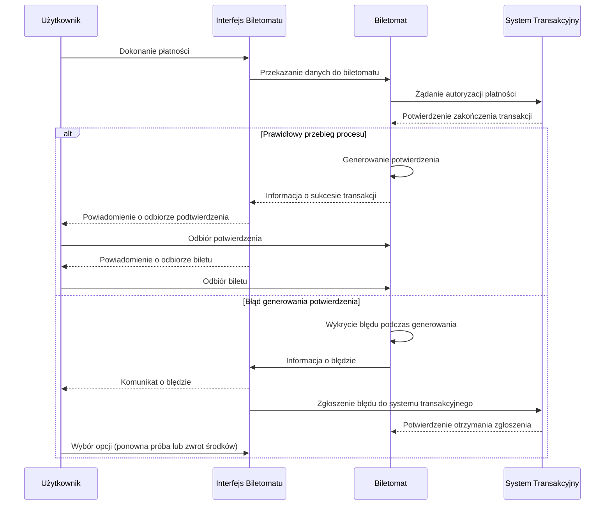

## 2. Historie dla biletomatu (urządzenia)
1. Jako biletomat, chcę posiadać czytelny ekran dotykowy, aby użytkownik mógł łatwo nawigować po interfejsie.
2. Jako biletomat, chcę być wyposażony w różne metody płatności (terminal kart, czytnik gotówki, NFC), aby obsługiwać różnorodne transakcje.
3. Jako biletomat, chcę wydawać resztę w gotówce, jeśli użytkownik zapłaci nadmiarowo, aby transakcja była zgodna z oczekiwaniami.
4. Jako biletomat, chcę automatycznie aktualizować listę dostępnych biletów i ich cen, aby zapewnić zgodność z polityką przewoźnika.
5. Jako biletomat, chcę rejestrować wszystkie transakcje i wysyłać raporty do systemu centralnego, aby umożliwić monitoring i kontrolę operacji.

## Diagram przypadków użycia dla biletomatu

### 1. Generowanie potwierdzenia zakupu

### 2. Realizacja płatności

### 3. Wyświetlenie dostępnych biletów

### 4. Reset interfejsu po anulowaniu transakcji

### 5. Wspólny diagram

---

## DIAGRAMY SEKWENCJI
### 1. DIAGRAM SEKWENCJI DLA PRZYPADKU UŻYCIA GENEROWANIA POTWIERDZENIA ZAKUPU
• **AKTOR:** UŻYTKOWNIK.  
• **OBIEKTY:** INTERFEJS BILETOMATU, BILETOMAT, SYSTEM TRANSAKCYJNY.  
• **KOLEJNOŚĆ KOMUNIKATÓW:**  
  1 **UŻYTKOWNIK** dokonuje płatności w **INTERFEJSIE BILETOMATU**.  
  2 **INTERFEJS BILETOMATU** przekazuje dane do **BILETOMATU**.  
  3 **BILETOMAT** wysyła żądanie autoryzacji płatności do **SYSTEMU TRANSAKCYJNEGO**.  
  4 **SYSTEM TRANSAKCYJNY** przesyła potwierdzenie zakończenia transakcji do **BILETOMATU**.  
  5 **BILETOMAT** generuje potwierdzenie zakupu.  
  6 **BILETOMAT** informuje **INTERFEJS BILETOMATU** o sukcesie transakcji.  
  7 **INTERFEJS BILETOMATU** wyświetla użytkownikowi powiadomienie o możliwości odbioru potwierdzenia.  
  8 **UŻYTKOWNIK** odbiera potwierdzenie z **BILETOMATU**.  
  9 **INTERFEJS BILETOMATU** wyświetla użytkownikowi powiadomienie o możliwości odbioru biletu.  
  10 **UŻYTKOWNIK** odbiera bilet z **BILETOMATU**.  

#### **SCENARIUSZ ALTERNATYWNY 1 (BŁĄD GENEROWANIA POTWIERDZENIA):**  
  5a **BILETOMAT** wykrywa błąd podczas generowania potwierdzenia.  
  6a **BILETOMAT** informuje **INTERFEJS BILETOMATU** o błędzie.  
  7a **INTERFEJS BILETOMATU** wyświetla użytkownikowi komunikat o błędzie.  
  8a **INTERFEJS BILETOMATU** zgłasza błąd do **SYSTEMU TRANSAKCYJNEGO**.  
  9a **SYSTEM TRANSAKCYJNY** potwierdza otrzymanie zgłoszenia błędu.  
  10a **UŻYTKOWNIK** wybiera opcję ponownej próby lub zwrotu środków w **INTERFEJSIE BILETOMATU**.  

### WIZUALIZACJA DIAGRAMU SEKWENCJI

