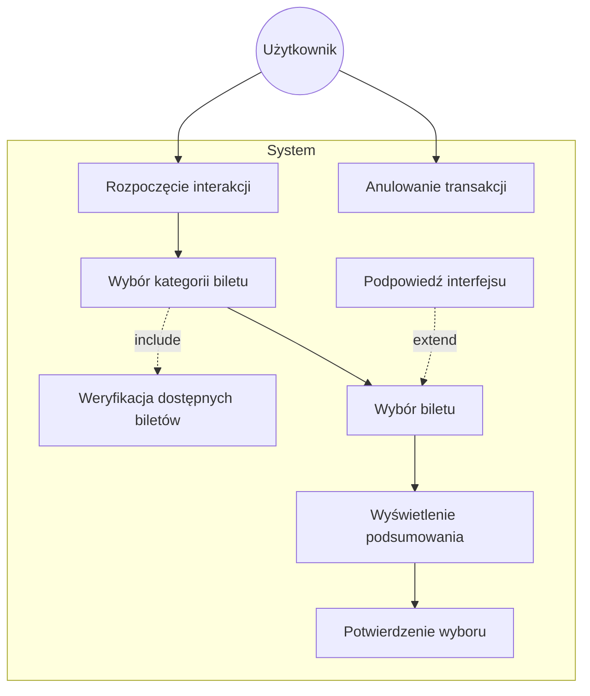
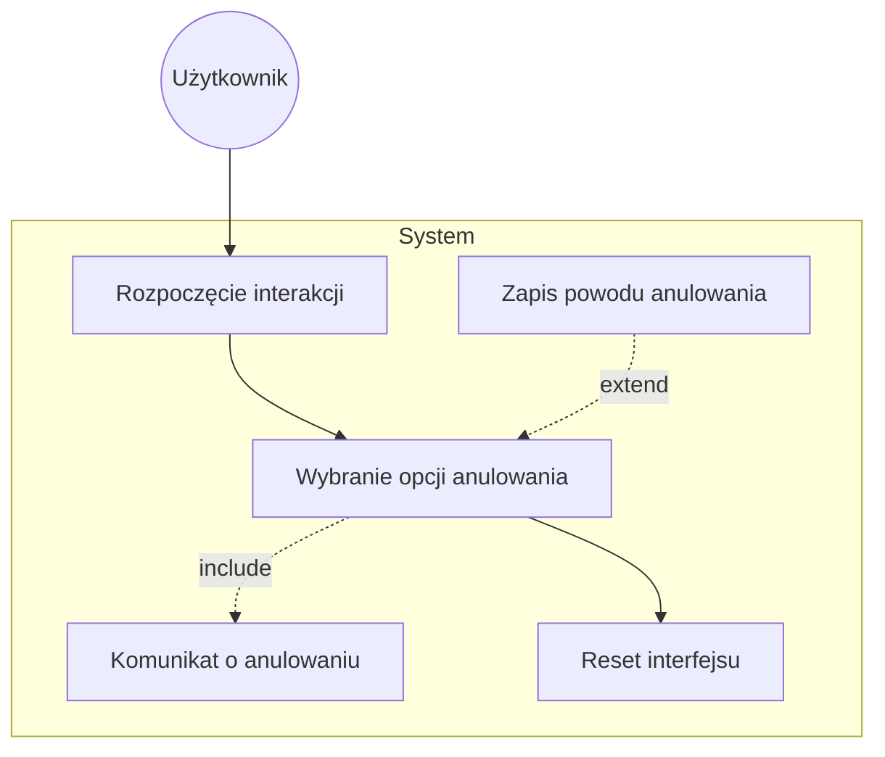
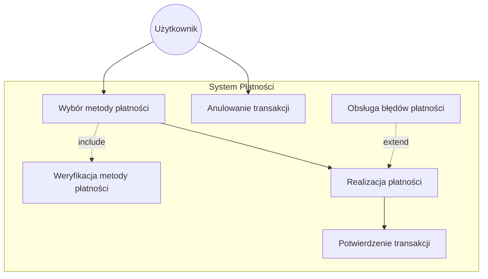
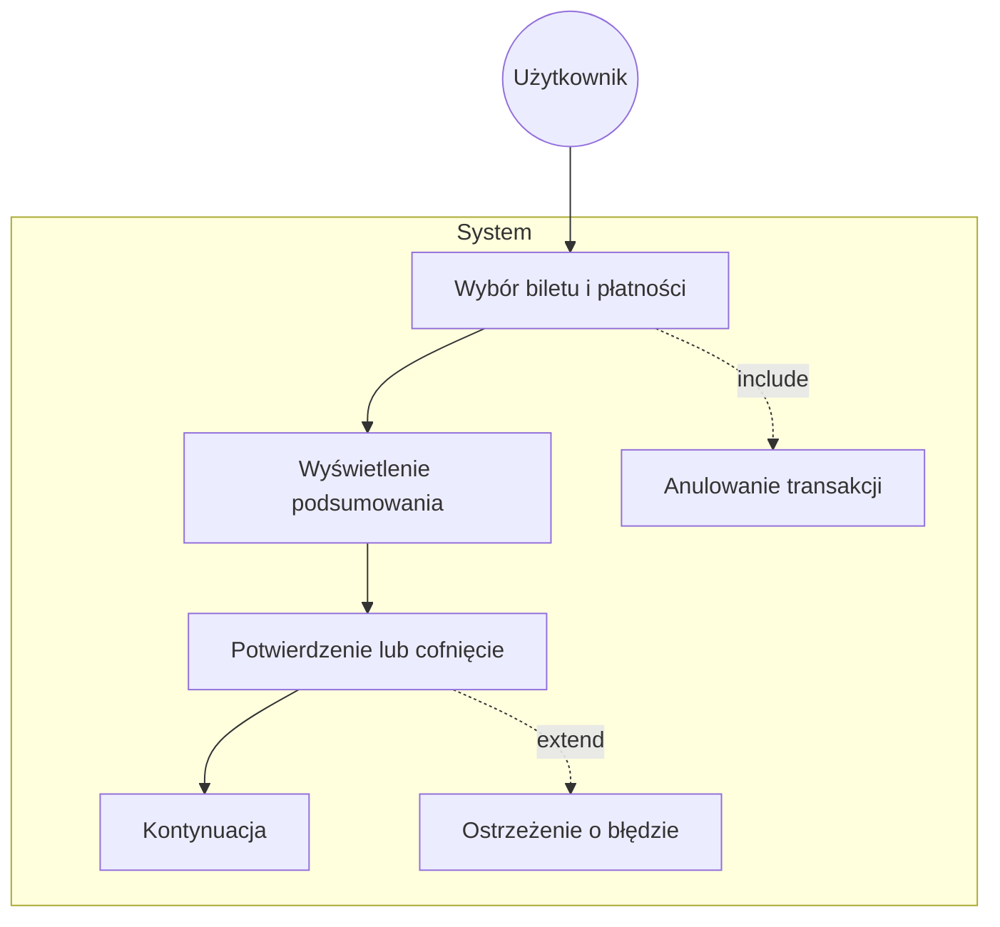
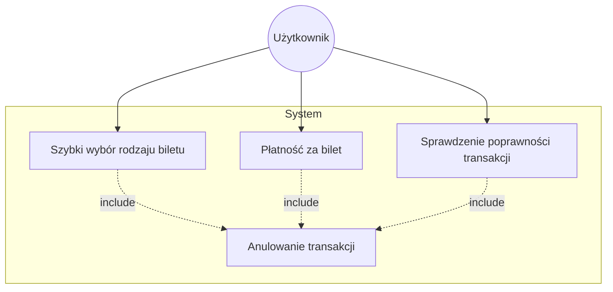
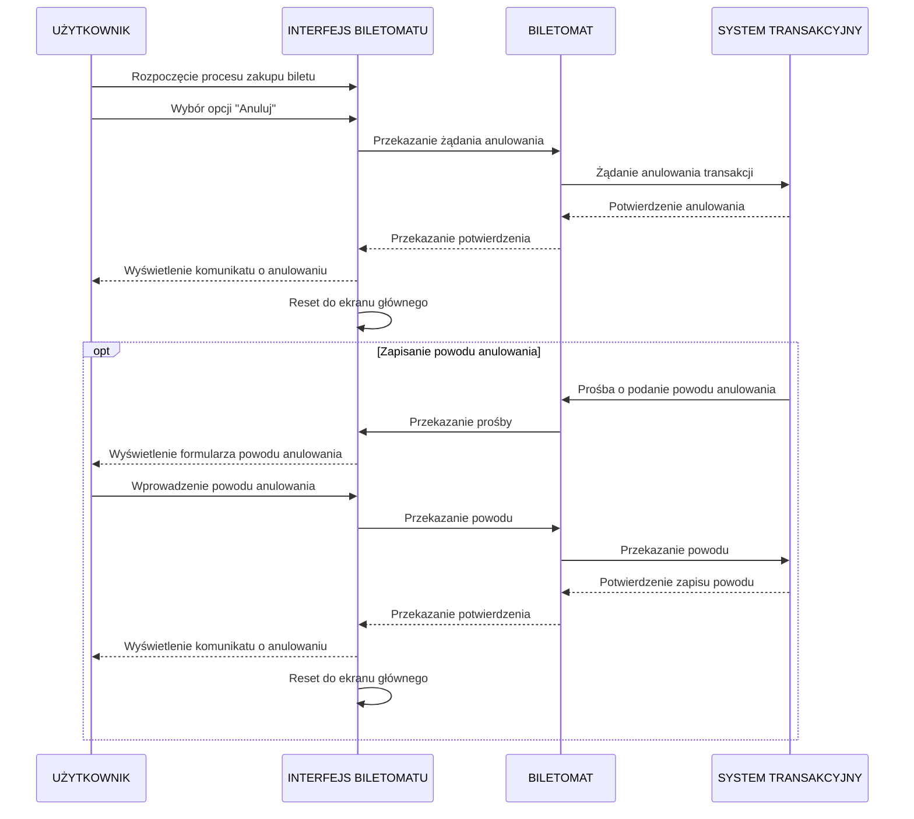
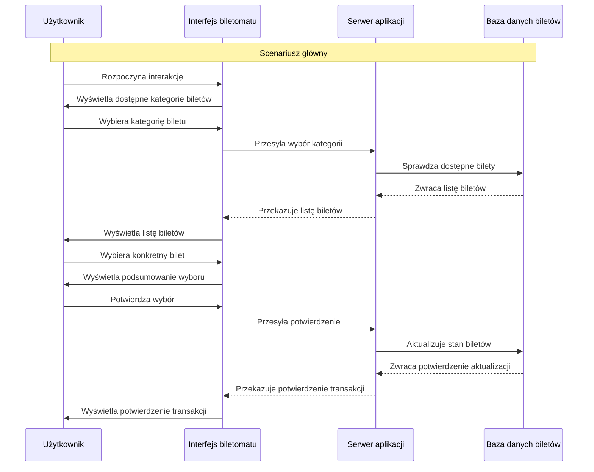

## 1. Historie dla użytkownika
1. Jako użytkownik, chcę płacić za bilet kartą, gotówką lub telefonem, aby mieć większą elastyczność w wyborze metody płatności.
2. Jako użytkownik, chcę otrzymać wyraźne instrukcje na ekranie, aby wiedzieć, jak dokonać zakupu krok po kroku.
3. Jako użytkownik, chcę widzieć czas pozostały na decyzję (np. wyświetlany licznik czasu), aby móc szybko podjąć działanie.
4. Jako użytkownik, chcę szybko wybrać rodzaj biletu, aby zminimalizować czas spędzony przy biletomacie.
5. Jako użytkownik, chcę mieć możliwość wyboru języka, aby móc korzystać z biletomatu bez względu na znajomość języka lokalnego.
6. Jako użytkownik, chcę sprawdzić poprawność transakcji przed jej finalizacją, aby uniknąć pomyłek.
7. Jako użytkownik, chcę otrzymać potwierdzenie zakupu (np. wydruk biletu lub elektroniczny bilet), aby móc korzystać z transportu zgodnie z przepisami.

## Diagram przypadków użycia dla użytkownika

### 1. Szybki wybór rodzaju biletu

### 2. Anulowanie transakcji

### 3.  Płatność za bilet

### 4. Sprawdzenie poprawności transakcji

### 5. Wspólny diagram

## DIAGRAMY SEKWENCJI  
### 1. DIAGRAM SEKWENCJI DLA PRZYPADKU UŻYCIA ANULOWANIA TRANSAKCJI  
- **AKTOR:** UŻYTKOWNIK.  
- **OBIEKTY:** INTERFEJS BILETOMATU, BILETOMAT, SYSTEM TRANSAKCYJNY.  
- **KOLEJNOŚĆ KOMUNIKATÓW:**  
  1. **UŻYTKOWNIK** rozpoczyna proces zakupu biletu poprzez **INTERFEJS BILETOMATU**.  
  2. **UŻYTKOWNIK** wybiera opcję "Anuluj" w dowolnym momencie procesu.  
  3. **INTERFEJS BILETOMATU** przekazuje żądanie anulowania do **BILETOMATU**.  
  4. **BILETOMAT** wysyła żądanie anulowania transakcji do **SYSTEMU TRANSAKCYJNEGO**.  
  5. **SYSTEM TRANSAKCYJNY** przetwarza żądanie i zwraca potwierdzenie anulowania.  
  6. **BILETOMAT** przekazuje potwierdzenie do **INTERFEJSU BILETOMATU**.  
  7. **INTERFEJS BILETOMATU** wyświetla **UŻYTKOWNIKOWI** komunikat potwierdzający anulowanie transakcji.  
  8. **INTERFEJS BILETOMATU** resetuje się do ekranu głównego.  

#### **SCENARIUSZ OPCJONALNY (ZAPISANIE POWODU ANULOWANIA):**  
  5a. **SYSTEM TRANSAKCYJNY** prosi **BILETOMAT** o podanie powodu anulowania.  
  6a. **BILETOMAT** przekazuje prośbę do **INTERFEJSU BILETOMATU**.  
  7a. **INTERFEJS BILETOMATU** wyświetla **UŻYTKOWNIKOWI** formularz do wprowadzenia powodu anulowania.  
  8a. **UŻYTKOWNIK** wprowadza powód anulowania.  
  9a. **INTERFEJS BILETOMATU** przekazuje powód do **BILETOMATU**, a następnie do **SYSTEMU TRANSAKCYJNEGO**.  
  10a. **SYSTEM TRANSAKCYJNY** zapisuje powód anulowania i zwraca potwierdzenie.  
  11a. **INTERFEJS BILETOMATU** wyświetla komunikat o anulowaniu i resetuje się do ekranu głównego. 

### WIZUALIZACJA DIAGRAMU SEKWENCJI  

### 2. Scenariusz dla przypadku użycia " Szybki wybór rodzaju biletu"

**Aktor:** Użytkownik.

**Obiekty:** Interfejs biletomatu, serwer aplikacji, Baza danych biletów.

**Kolejność komunikatów:**

  1. Użytkownik rozpoczyna interakcję z biletomatem.
  2. Interfejs wyświetla dostępne kategorie biletów (np. jednorazowe, okresowe).
  3. Użytkownik wybiera kategorię biletu.
  4. Interfejs przesyła wybór do serwera.
  5. Serwer sprawdza dostępne bilety w bazie danych.
  6. Baza danych zwraca listę biletów do serwera.
  7. Serwer przekazuje listę biletów do interfejsu.
  8. Interfejs wyświetla listę biletów użytkownikowi.
  9. Użytkownik wybiera konkretny bilet.
  10. Interfejs wyświetla podsumowanie wyboru.
  11. Użytkownik potwierdza wybór.
  12. serwer przetwarza transakcję.
  13. Baza danych aktualizuje stan biletów.
  14. System biletowy zwraca potwierdzenie do interfejsu.
  15. Interfejs wyświetla potwierdzenie transakcji użytkownikowi.

### Diagram sekwencji dla przypadku użycia " Szybki wybór rodzaju biletu"

